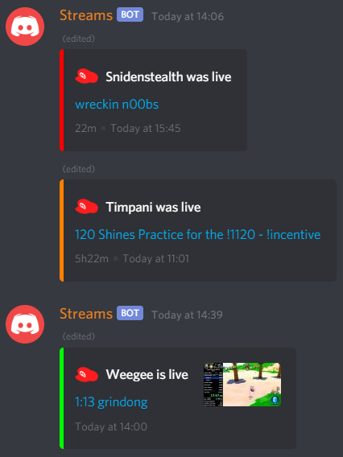
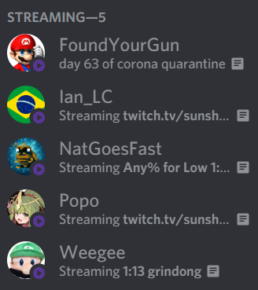

***Working on v3 – all docs are out of date.***

# Streams
This is a bot that **tracks who's streaming a particular game** on Twitch, and:
* posts + updates the stream into a Discord (messages) channel
* assigns the streamer's Discord account a special role while the stream is up

An instance of the bot manages a single game, and a single role on a single server, but arbitrarily-many message channels. It can be run role-only or message-only.

User guide below; guide to source code [here](design.md). Example pictures at the bottom of this page.

## Overview
**Messages**  
New streams are posted with a green embed. When a stream goes offline, its post is edited to orange and swapped with the oldest green post. If the stream comes back online within 15m, the orange post turns green and is swapped back into the greens, else it turns red. In this way, active streams are at the front, all history is preserved, and stream outages don't cause spam. The post contains the original start time of the stream, and total duration (including outages) once ended.

**Roles**  
A user simply has the role while live. Display the role in the members sidebar, and each user's stream will be easily clickable provided ey is online on Discord, has Twitch correctly linked, and has streamer mode enabled.

*Since Discord doesn't reveal a user's associated Twitch account to bots, the roles functionality requires manually-posted lists of Discord user IDs and associated Twitch usernames, marked **dir**, in a separate Discord channel. The bot will parse the 50 latest posts in a channel that have a syntax as follows:*

```
dir <optional-comment-here-with-no-newlines>
<discord-user-ID-1> <twitch-user-handle1>
<discord-user-ID-2> <twitch-user-handle2>
...
```

**Filtering**  
The dir tables inherently filter which Discord users get assigned a role. A message channel can also be filtered. This means it accepts only streams whose users are in dir or whose tags/titles match a list of tags/keywords. E.g.
```
FILTER_TAGS=7cefbf30-4c3e-4aa7-99cd-70aabb662f27
FILTER_KEYWORDS=speedrun,any%,all dungeons,glitchless,race,mss,pausa,practice
```
*(that's the Speedrun tag.)*

**Deployment**  
The bot is designed to run locally and on persistent/non-persistent VPS/PaaS, so there's console logging to one sink but no file logging, and config (see section below) [stored outside Git](https://12factor.net/config). The bot persists its state when it starts by reading its own message channels and by finding which users currently have the role, so is robust against being restarted at any time.

## Deployment
Config is loaded from an .env file if it exists (settings listed in Config section), else it's expected to already have been loaded into the shell's env vars (e.g. on Heroku). The .env has syntax:
```
KEY1=VALUE1
KEY2=VALUE2
...
```

**Example deployment methods:**  
* **Local**: get the binary for your OS from [releases](https://github.com/Pyorot/streams/releases), place a new folder next to it for any instance you want to run, and place a .env file in each folder. Then run a console in the subfolder with the .env, and just execute `../main` or `../main.exe` to run the binary from the parent folder. Sample folder structure:
  ```
  bot
  ├───main.exe
  ├───sms
  │   └───.env
  └───twwhd
      └───.env
  ```
  *It's best to run it with [a script that restarts it](https://stackoverflow.com/a/697017), since it may crash on serious API errors.* 
* [**Heroku**](https://www.heroku.com): clone and push this repo, and set env vars within Heroku's website/CLI. The included go.mod and Procfile instruct Heroku how to build and run the program.
* [**Google Cloud Compute Engine**](https://cloud.google.com/compute): create a local deployment as above, then use gcloud scp to copy it over to the VPS and gcloud ssh with tmux to run each instance; see [guide](https://youtu.be/VEn70C7S5Q8).

# Config
The settings are:
* **TWITCH_ID** – Twitch API key.
* **TWITCH_SEC** – Twitch API secret (required since May 2020).
* **DISCORD** – Discord API token.
* **GAME_ID** – ID of the game to track (requires an API request to find out).
* **MSG_CHANNELS** – list of Discord channel IDs separated by commas, no spaces. Prepend + for filtered channels and * for unfiltered. E.g. `+693315004228698142,*296066428694429697`.
* **MSG_ICON** – custom icon for message embeds.
* **MSG_ICON_PASS** – icon for streams that pass the filter (tag/keyword/dir); requires and overrides `MSG_ICON`.
* **MSG_ICON_KNOWN** – icon for users that are in dir; requires and overrides `MSG_ICON_PASS`.
* **ROLE** – ID of Discord streams role.
* **ROLE_SERVER** – ID of Discord server containing streams role.
* **TWICORD_CHANNEL** – ID of Discord channel for loading dir directory.
* **FILTER_TAGS** – list of Twitch tags to filter streams for (in UUID format), separated by commas, no spaces.
* **FILTER_KEYWORDS** – list of substrings to filter stream titles for, separated by commas, no spaces.

## Pix


